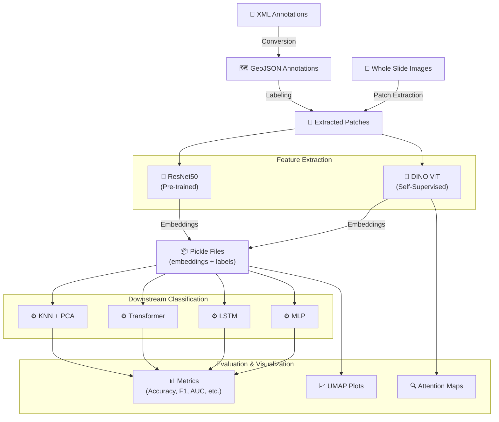

# WSI Analysis — Tumor Classification from Whole Slide Images

A deep learning pipeline for classifying histopathological tissue patches extracted from Whole Slide Images (WSI) as **tumoral** or **non-tumoral**. The project leverages self-supervised learning with DINO (Self-Distillation with No Labels) and Vision Transformers to extract meaningful embeddings, which are then classified using multiple downstream models (MLP, LSTM, Transformer, KNN).

## Architecture



The pipeline follows a modular, multi-stage approach:

1. **Patch Extraction** — WSI images are divided into fixed-size patches
2. **Annotation Processing** — XML annotations are converted to GeoJSON format and used to label patches as tumoral/non-tumoral
3. **Feature Extraction** — Pre-trained DINO (Vision Transformer) and ResNet50 models generate embedding vectors for each patch
4. **Classification** — Downstream classifiers (MLP, LSTM, Transformer, KNN) are trained on the embeddings for binary tumor detection
5. **Evaluation** — Quantitative metrics and qualitative visualizations (UMAP, attention maps) assess model performance

## Tech Stack

| Category | Technology |
|----------|-----------|
| Language | Python |
| Deep Learning | PyTorch |
| Self-Supervised Learning | DINO (Facebook Research) |
| Feature Extractors | Vision Transformer (ViT), ResNet50 |
| Classical ML | scikit-learn (KNN, PCA, metrics) |
| Image Processing | OpenCV, scikit-image, PIL |
| Visualization | matplotlib, seaborn, UMAP |
| Data Format | Pickle (.pkl), GeoJSON |
| Logging | Python logging, coloredlogs |
| Notebooks | Jupyter |

## Project Structure

```
mla-prj-23-superawesometeamname/
├── images/                        # Logo and screenshots
├── src/
│   ├── models/
│   │   ├── vision_transformer.py  # ViT architecture (DINO backbone)
│   │   └── embeddings_classification.py  # MLP, LSTM, Transformer classifiers
│   ├── utils/
│   │   └── loaders.py             # DatasetEmbeddings loader from pickle
│   ├── main_dino.py               # DINO self-supervised training script
│   ├── train_classifier.py        # Downstream classifier training script
│   ├── classification_task.py     # KNN classification with PCA
│   ├── utils.py                   # DINO utilities (distributed training, schedulers, etc.)
│   ├── attention_visualization_utils.py  # Attention map visualization tools
│   ├── _patch_extraction.ipynb          # WSI patch extraction
│   ├── _xml_to_geojson_conversion.ipynb # Annotation format conversion
│   ├── _create_embeddings.ipynb         # Generate embeddings from patches
│   ├── _classification_task.ipynb       # KNN classification experiments
│   ├── _classification_embeddings.ipynb # Embeddings-based classification
│   ├── _classification_crc.ipynb        # CRC dataset classification
│   ├── _resnet_50.ipynb                 # ResNet50 feature extraction
│   ├── _umap_visualization.ipynb        # UMAP embedding visualization
│   ├── _attention_visualization_256.ipynb # DINO attention maps
│   ├── _qualitative_eval_dino.ipynb     # Qualitative eval (DINO)
│   ├── _qualitative_eval_resnet50.ipynb # Qualitative eval (ResNet50)
│   ├── ckpts/                     # Model checkpoints (MLP, LSTM, Transformer)
│   ├── classification_results/    # Classification result plots
│   ├── UMAPs/                     # UMAP visualization images
│   ├── attention_visualization_results/ # Attention map outputs
│   ├── data/                      # Dataset directory (not tracked)
│   └── image_demo/                # Demo patch images
├── .gitignore
└── README.md
```

## Getting Started

### Prerequisites

- Python 3.8+
- CUDA-compatible GPU (recommended) or Apple Silicon (MPS supported)

### Installation

1. Clone the repository:
   ```bash
   git clone <repository-url>
   cd mla-prj-23-superawesometeamname
   ```

2. Install dependencies:
   ```bash
   pip install torch torchvision numpy scikit-learn scikit-image matplotlib seaborn opencv-python umap-learn coloredlogs pillow tqdm
   ```

3. Place your WSI data and annotation files in `src/data/`.

### Running

#### 1. Patch Extraction
Run the `src/_patch_extraction.ipynb` notebook to extract patches from WSI images.

#### 2. DINO Self-Supervised Training
```bash
python src/main_dino.py --arch vit_small --data_path /path/to/patches --epochs 10 --batch_size_per_gpu 64
```

#### 3. Generate Embeddings
Run `src/_create_embeddings.ipynb` to extract embeddings from patches using the trained DINO model or a pre-trained ResNet50.

#### 4. Train Downstream Classifiers
```bash
python src/train_classifier.py --model MLP --data_path /path/to/embeddings.pkl --epochs 50 --batch_size 32
```

Available models: `MLP`, `LSTM`, `Transformer`

#### 5. KNN Classification
```python
from classification_task import run_classification_task
run_classification_task("/path/to/embeddings.pkl")
```

### Evaluation

The training script automatically logs metrics every 10 epochs:
- **Accuracy**, **Precision**, **Recall**, **F1 Score**
- **ROC AUC**, **Specificity**
- **Confusion Matrix** (FP, FN counts)

Visualization notebooks generate:
- **UMAP plots** — embedding space visualization for different models
- **Attention maps** — DINO self-attention heatmaps overlaid on patches
- **Confusion matrices** — classification performance heatmaps

## Models

| Model | Type | Input | Description |
|-------|------|-------|-------------|
| DINO ViT | Self-Supervised | Raw patches (256x256) | Feature extractor using self-distillation |
| ResNet50 | Pre-trained | Raw patches | CNN-based feature extractor |
| MLP | Supervised | Embeddings | 2-layer feedforward classifier |
| LSTM | Supervised | Embeddings | Recurrent classifier with hidden state |
| Transformer | Supervised | Embeddings | Attention-based classifier |
| KNN + PCA | Classical ML | Embeddings | K-Nearest Neighbors with PCA (99% variance) |

## License

Distributed under the MIT License.
