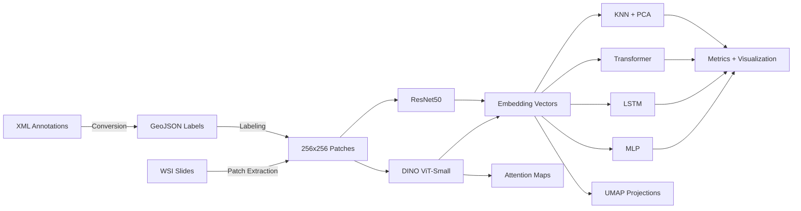

# WSI Analysis — Tumor Classification from Whole Slide Images

> Binary tumor detection pipeline for histopathological tissue using self-supervised Vision Transformers and multi-model downstream classification.

## Overview

Whole Slide Images (WSIs) in digital pathology are gigapixel-scale scans that cannot be processed directly by standard deep learning models. This project builds a complete pipeline to extract, encode, and classify tissue patches from WSIs as tumoral or non-tumoral, combining self-supervised representation learning with supervised downstream classification.

The core approach uses DINO (Self-Distillation with No Labels) to train a Vision Transformer on unlabeled histopathological patches, producing rich feature embeddings without requiring manual annotation at the patch level. These embeddings are then evaluated across four downstream classifiers — MLP, LSTM, Transformer, and KNN with PCA — to benchmark which architecture best separates tumoral from healthy tissue. A parallel ResNet50 feature extraction path provides a CNN baseline for direct comparison against the ViT-based representations.

The pipeline also includes interpretability tools: DINO self-attention maps highlight tissue regions the model considers salient, and UMAP projections visualize how well the learned embedding space separates the two classes. An additional transfer learning evaluation on the CRC-100K colorectal cancer dataset tests whether the learned representations generalize beyond the original WSI source.

## Architecture



The design separates feature extraction from classification, allowing each stage to be developed and evaluated independently. DINO's self-supervised pretraining removes the dependency on large labeled datasets — a practical advantage in medical imaging where expert annotation is expensive. The multi-classifier benchmark then reveals which downstream architecture best exploits the learned representations, rather than committing to a single model choice upfront. Cosine annealing learning rate scheduling and Kaiming weight initialization are used across the supervised models to stabilize training on the relatively compact embedding space.

## Tech Stack

| Category | Technologies |
|----------|-------------|
| Deep Learning | PyTorch, torchvision |
| Self-Supervised Learning | DINO (Facebook Research) |
| Feature Extractors | Vision Transformer (ViT-Small), ResNet50 |
| Classical ML | scikit-learn (KNN, PCA, RandomizedSearchCV) |
| Image Processing | OpenCV, scikit-image, Pillow |
| Visualization | matplotlib, seaborn, UMAP |
| Data Handling | NumPy, pandas, pickle |
| Logging | Python logging, coloredlogs |

## Project Structure

```
├── src/
│   ├── models/
│   │   ├── vision_transformer.py          # ViT architecture (DINO backbone)
│   │   └── embeddings_classification.py   # MLP, LSTM, Transformer classifiers
│   ├── utils/
│   │   └── loaders.py                     # DatasetEmbeddings loader from pickle
│   ├── main_dino.py                       # DINO self-supervised training entry point
│   ├── train_classifier.py               # Downstream classifier training script
│   ├── classification_task.py            # KNN classification with PCA + hyperparameter search
│   ├── utils.py                          # DINO training utilities (distributed, schedulers)
│   ├── attention_visualization_utils.py  # Self-attention heatmap generation
│   ├── _patch_extraction.ipynb           # WSI → fixed-size patch extraction
│   ├── _xml_to_geojson_conversion.ipynb  # Annotation format conversion
│   ├── _create_embeddings.ipynb          # Feature extraction (DINO / ResNet50)
│   ├── _classification_embeddings.ipynb  # Supervised classifier training
│   ├── _classification_task.ipynb        # KNN classification experiments
│   ├── _classification_crc.ipynb         # Transfer learning on CRC-100K dataset
│   ├── _umap_visualization.ipynb         # Embedding space visualization
│   ├── _attention_visualization_256.ipynb # DINO attention map generation
│   ├── _qualitative_eval_dino.ipynb      # Qualitative evaluation (DINO)
│   ├── _qualitative_eval_resnet50.ipynb  # Qualitative evaluation (ResNet50)
│   ├── _resnet_50.ipynb                  # ResNet50 feature extraction
│   ├── ckpts/                            # Saved model checkpoints (MLP, LSTM, Transformer)
│   ├── classification_results/           # Classification performance plots
│   ├── UMAPs/                            # UMAP embedding visualizations
│   └── image_demo/                       # Sample histopathological patches
├── .gitignore
├── LICENSE                               # BSD 3-Clause License
└── README.md
```

## Results

<!-- TODO: verify — no metric outputs are saved in the notebook cells. The values below should be verified by the author against actual training logs or notebook outputs. -->

The pipeline evaluates four downstream classifiers on DINO and ResNet50 embeddings, reporting accuracy, precision, recall, F1 score, ROC AUC, and specificity. Checkpoints are saved every 10 epochs with full metric snapshots for both train and test sets.

Classification result plots are available in `src/classification_results/` comparing DINO vs. ResNet50 embeddings on both the balanced and imbalanced dataset configurations. UMAP visualizations in `src/UMAPs/` show the embedding space structure for each feature extractor, with separate plots for the original WSI dataset and the CRC-100K transfer learning experiment.

## Getting Started

### Prerequisites

- Python 3.8+
- CUDA-compatible GPU recommended (MPS/Apple Silicon also supported)

### Installation

```bash
git clone https://github.com/username/WSI_analysis.git
cd WSI_analysis

pip install torch torchvision numpy scikit-learn scikit-image \
    matplotlib seaborn opencv-python umap-learn coloredlogs \
    pillow tqdm pandas
```

### Usage

**1. Patch Extraction** — Run `src/_patch_extraction.ipynb` to extract fixed-size patches from WSI images.

**2. Annotation Processing** — Run `src/_xml_to_geojson_conversion.ipynb` to convert XML annotations to GeoJSON format.

**3. DINO Self-Supervised Training**

```bash
python src/main_dino.py --arch vit_small --data_path /path/to/patches --epochs 10 --batch_size_per_gpu 64
```

**4. Generate Embeddings** — Run `src/_create_embeddings.ipynb` to extract embedding vectors using the trained DINO model or a pretrained ResNet50.

**5. Train Downstream Classifiers**

```bash
python src/train_classifier.py --model MLP --data_path ./src/data/embeddings/dino.pkl --epochs 50 --batch_size 32
```

Available models: `MLP`, `LSTM`, `Transformer`

**6. KNN Classification**

```python
from src.classification_task import run_classification_task
run_classification_task("./src/data/embeddings/dino.pkl")
```

**7. Visualization** — Run `_umap_visualization.ipynb` for embedding space plots and `_attention_visualization_256.ipynb` for DINO self-attention heatmaps.


